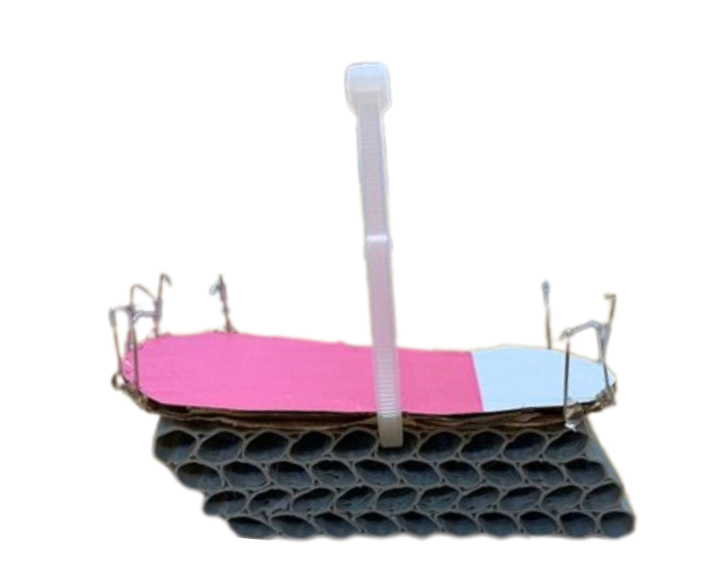
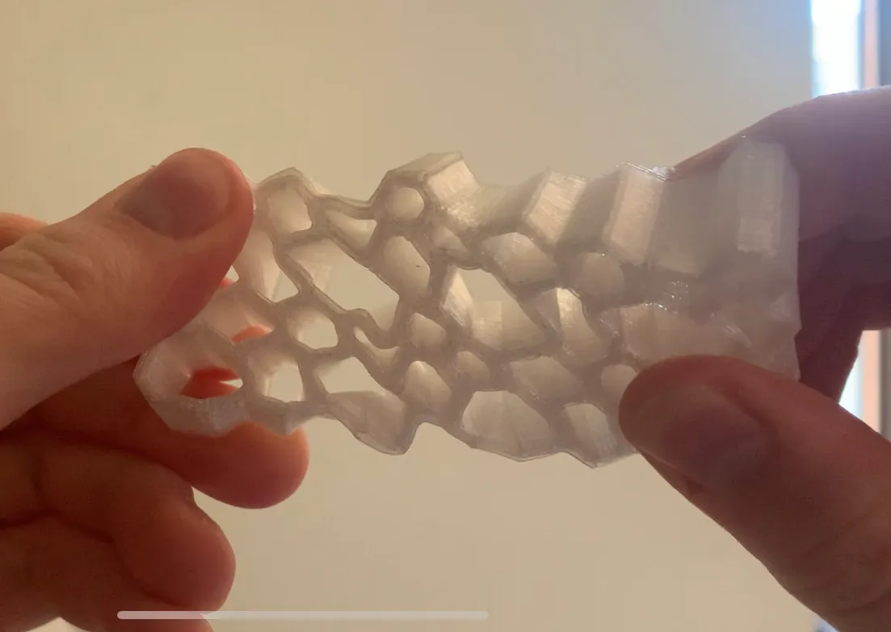
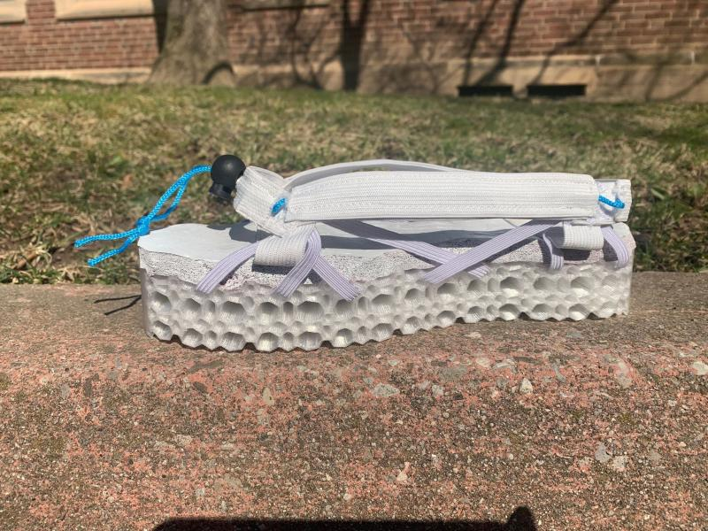
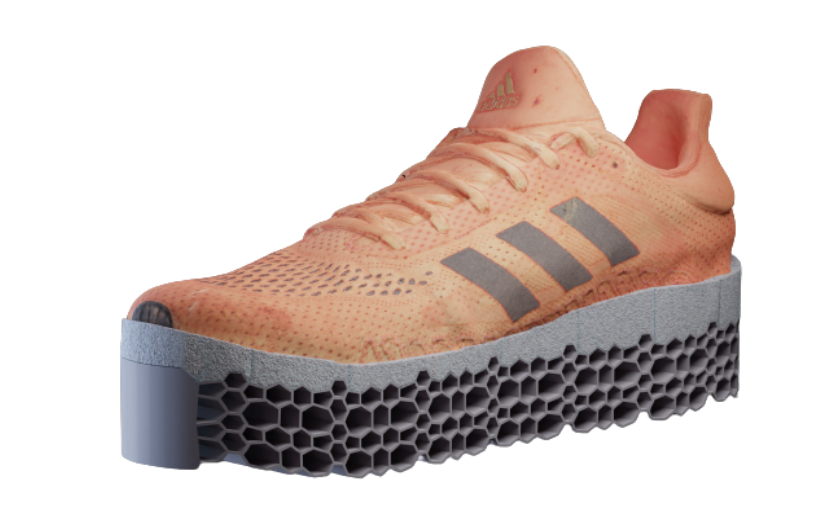

# Sole-Survivor
Design Project 4 of a 1st-year design course, where an innovative solution to address the concerns of an MS patient was developed.

The Sole-Survivor is an innovative sole attachment designed to adapt seamlessly to varying terrains. It is engineered to complement the Bioness L300, a device used by patients to mitigate spasms triggered by uneven surfaces. Constructed from TPU and featuring a distinctive hexagonal pattern, the Sole-Survivor enhances stress capacity and optimizes its deformation characteristics, ensuring both durability and functionality.

The initial concept for the Sole-Survivor was highly complex: integrating springs and linear actuators to dynamically reshape the sole based on a topographical map generated by a LiDAR sensor. This approach aimed to actively level the ground beneath the user. However, after assessing the technical feasibility and design intricacies, I proposed an alternative idea: leveraging heat-expanding foam to achieve adaptive deformation. While this concept was ultimately not implemented, it prompted further exploration into materials capable of structural transformation.

Although foam insoles are commonplace, we discovered a gap in the market for soles that actively deform to match ground contours. Our research revealed no existing solutions of this nature, but we drew inspiration from Adidas’ lattice-structured shoes, which demonstrated significant potential for similar applications. This insight led us to adopt a horizontally stacked hexagonal pattern, chosen for its structural integrity and compatibility with 3D printing without additional supports.

*Our first low fidelity prototype of the concept behind the sole*

Our initial prototypes employed Soft-PLA and a basic hexagonal configuration. However, these early iterations failed to meet performance requirements: the material lacked sufficient load-bearing capacity, and the pattern compressed unevenly, offering inadequate support.

To address these challenges, I consulted Dr. Hatem Zurob, Head of the Materials Department and a renowned expert in structural materials. Dr. Zurob introduced a patterning technique that enhances structural stress capacity by incorporating diverse polygonal geometries. This insight informed the development of a new design iteration, marking a significant step forward in the Sole-Survivor's evolution.

*A small sample including a "flawed" hexagon pattern, increasing the load capacity of the material and design*

## The Final Result

The Sole-Survivor is an attachable shoe sole that conforms to the ground below it, ensuring that the user experiences a 'flat' surface at all times. It achieves this by compressing and adapting to the shape of objects beneath it while maintaining a level surface on top.

The sole features a simple attachment system that maximizes contact between the shoe and the sole, eliminating any flopping during use. The design includes an easy-to-use squeeze-button fastening mechanism and is compatible with various shoe sizes.

*The High Fidelity Prototype that was used to demonstrate the capabilities of the sole*

Future plans for the Sole-Survivor include offering shoes with the sole integrated directly into the design, as well as further enhancing the attachment system to make it customizable for different shoe sizes and tailored to individual body weights.

*A concept of what the sole may look like when integrated directly into shoes*
